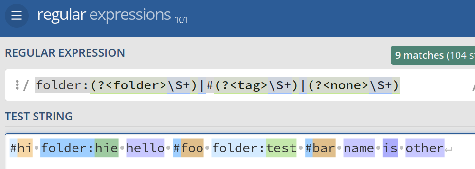

# 요구사항

입력된 단어들을 주어진 입력 토큰에 맟게 추출한다.
각 토큰들은 주어진 패턴을 바탕으로 구분한다.

1. 어떤 값으로 파싱할 건지는
   규칙을 외부에서 주입할 수 있게 한다.

2.

### 규칙 주입 예시

```typescript
const rule = [
  "key" : /#/
  "key" : /folder:/
  "key" : / /
]
```

```typescript
const tokenzier = new PrefixTokenizerFactory.ruleConfig(rule).build();
const result = tokenizer.tokenize('folder:bar hello #foo hi');
```

### 토큰화 결과

주입된 rule에서 설정한 key 별로 list로 저장된다.

```typescript
result.get('key'); // --> list of parsed tokens
```

### 예시



그 외에 존재하지 않는 모든 값은 type none으로 분류한다.

#### 입력 예시

folder:bar hello #foo hi

#### 출력 결과
